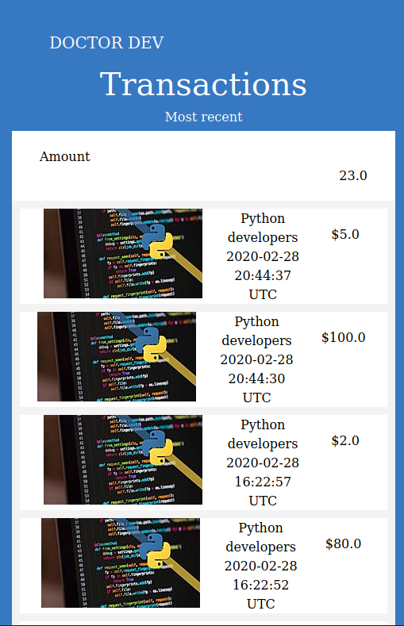

# Doctor Dev

# [Live version](https://doctordev-project.herokuapp.com/)

This project consists of an application for handling transactions. Users can create an account, create groups and send transactions to other groups as a way of supporting the community. This is a capstone project called Group our transactions, which is part of the Microverse curriculum for the Ruby on Rails course.

## Framework

- Ruby on Rails

## Database

- PostgreSQL 

## Testing tools

- RSpec
- Capybara
- FactoryBot
- Shoulda Matchers

## App Functionalities

- Create a new account
- Login
- Create transactions
- Create groups
- See transactions that belongs to a specific group

## Author

[Julian Belmonte](https://github.com/jucora)
